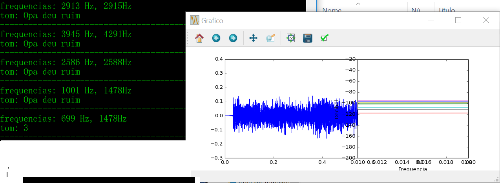
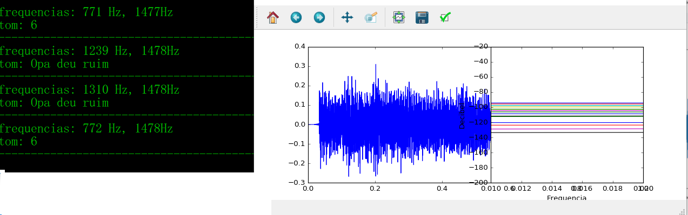
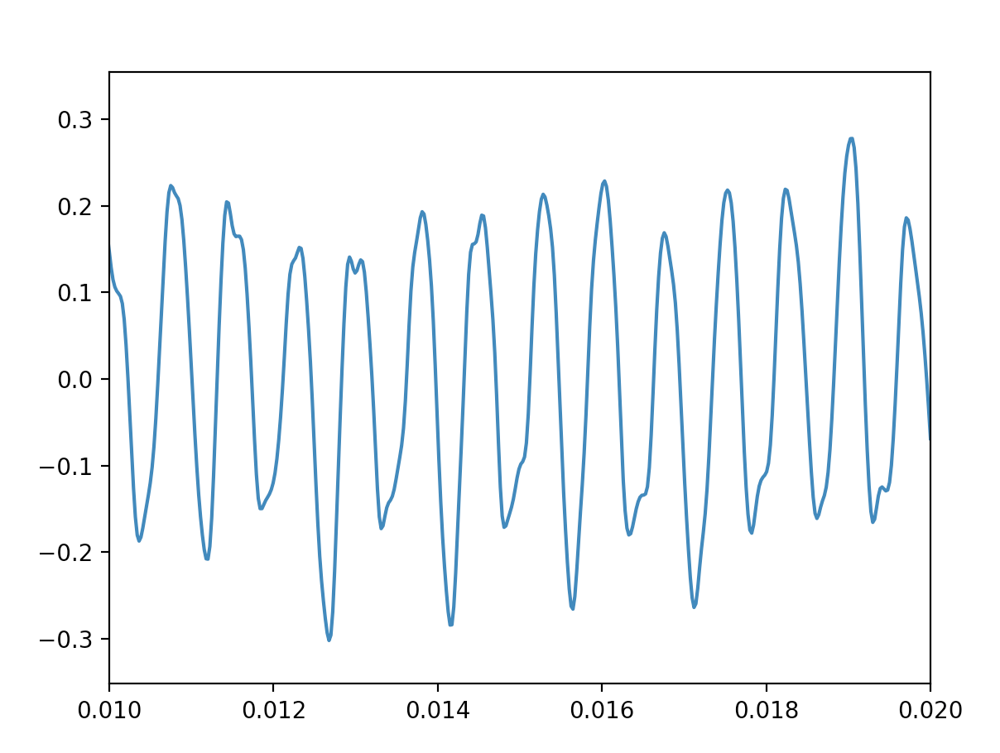

# Proj-5-DTMF
Projeto 5 Camada Física - 2017.2 // 2 parte. 

# Decoder de frequências

Os resultados mostrados a seguir mostram os testes feitos a partir do aúdio de um celular e um computador. Eles mostram que, a partir das 2 bases de frequência específicas, é possível identificar qual é o tom, variando de 0 a 9. Além disso, o tempo escolhido para a atualização do gráfico foi de 1 segundos. Enquanto o do áudio que foi gerado, 2 segundos.  Estes tempos foram os que mais ajudaram para determinar os parâmetros desejados.

 

   
   
   
   
 
   
  

# Descrição da geração de frequências sonoras 

Segundo a tabela de frequências presente abaixo, é possível identificar a geração de frequências sonoras. somase duas ondas senoidais composta por cada frequência do tom. Por exemplo, para gerar o tom do número 5, somam-se as ondas senoidais representadas por sen(2πft) sendo f1 =  1336 Hz e f2 = 770 Hz. O tempo é dado por um intervalo entre 0 e 1 com 44100 passos. É utilizada uma frequência alta e uma baixa, fazendo com que seja muito difícil de se produzir estas combinações de frequência com a voz humana.E que, assim, o sinal elétrico seja identificado corretamente.

 

# Descrição dos tons -comparação da onda real e da recebida

# Tons gerados (de 0 a 9, respectivamente)
Gerados | Recebidos
-|-
 |  
 |  
 |  
 |  
 |  
 |  
 |  
 |  
 |  
 |  
 |  
 
 
# Como sons diferem se possuem a mesma frequência? TIMBRE!!
 
## O que é timbre?

Embora esta característica seja conhecida há séculos, só com o surgimento da electrónica é que foi possível compreender o timbre com mais exatidão.

O lá central produzido por um piano tem uma frequência de 440 Hz, a mesma nota produzida por um violino possui a mesma frequência. O que dificulta diferenciar os dois sons e a fonte sonora é a forma da onda ou a envoltória sonora.

:sparkles:

## Forma de onda:

Quando um instrumento musical é capaz de produzir sons, entra em vibração, uma série de ondas sinusoidais são emitidas. Além da frequência fundamental que define a nota, várias frequências harmónicas (ondas com frequências componentes dos sinais que são um múltiplo inteiro da frequência fundamental) também são emitidas. Qualquer objeto em vibração emite frequências harmónicas que soam à nota fundamental, porém o ouvido humano não é capaz de ouvir harmónicos com frequências superiores a 20000 Hz.

Devido às características de cada instrumento, alguns harmónicos menores e audíveis possuem amplitude diferente de um instrumento para outro. Se adicionarmos a amplitude da frequência fundamental às amplitudes dos harmónicos, a forma de onda obtida já não será sinusoidal, mais sim irregular. Como a combinação exacta das amplitudes vária de cada instrumento, as formas de onda serão diferentes.

Referências : https://anasoares1.wordpress.com/2011/01/31/som-e-caracteristicas-do-som-frequencia-amplitude-e-timbre/
